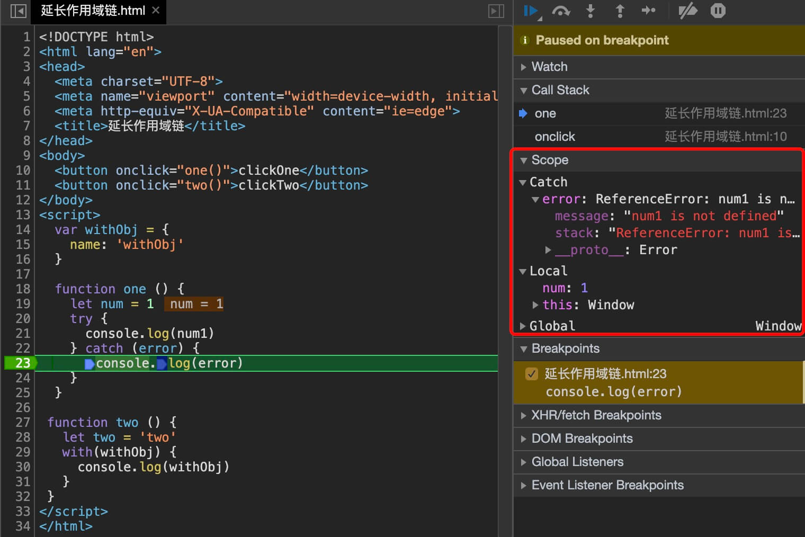

# 第4章 变量、作用域和内存问题
## 4.1 基本类型和引用类型的值
* 按值访问，可以直接操作保存在变量中的实际的值
  * Undefined
  * Null
  * Boolean
  * Number
  * String
* 按引用访问
  * Object

### 4.1.1 动态的属性
### 4.1.2 复制变量值
* 基本类型值（两个变量值一样，当时相互独立）
* 引用类型值（复制的是引用地址值，相互独立，但两个变量的值仍然指向同一个对象）

### 4.1.3 传递参数
>所有函数的参数都是按值传递的

```js
// 示例1
let num = 100;
let obj = {name:'Alice'}; // obj存储着对象的地址值 0x000000

function test(num,obj){
  // o 保存着对象的地址 0x000000，与外部的obj指向同一个对象
  let n = num; // 100
  let o = obj; // 指向 {name:'Alice'}
}
test(num,obj);

// 示例2
function setName(obj) {
  obj.name = 'Alice';
  obj = new Object();
  obj.name = 'Tom';
}
var person = new Object();
setName(person);
console.log(person.name); // Alice

```
>`setName()`的内部`obj`会在函数执行完成后被销毁

### 4.1.4 检测类型
* `typeof` 只能检测基本类型，引用类型一律返回 `Object`
* `instanceof` 检测引用类型

>`instanceof` 检测的缺点，只要是引用类型的都属于 `Object`
```js
// instanceof 的缺点
let arr = [];
arr instanceof Object; // true
arr instanceof Array; // true

function test(){

}

test instanceof Object; // true
```

## 4.2 执行环境及作用域

概念
* 函数执行环境
* 执行环境栈
* 作用域/作用域链

>分析执行环境与作用域

分析：
* 创建 `one()` 执行环境，压栈
* 调用 `two()` ，创建 `tow()` 执行环境，压栈
* 调用 `three()` ，创建 `three()` 执行环境，压栈
* `three()` 执行完成，出栈，继续执行 `tow()` 
* `two()` 执行完成，出栈，继续执行 `one()` 
* `one()` 执行完成，出栈

```js
// 执行环境
function one() {
  console.log('one');
  two();
  console.log('tow()出栈‘)
};

function two() {
  console.log('创建two()的执行环境，并压栈');
  three();
  console.log('two');
};

function three() {
  console.log('创建three()的执行环境，并压栈‘);
  console.log('three')
}

one();

// 作用域
function person(){
  let type = 'person'

  function man() {
    let name = 'Tom';
    console.log(type); // 可以访问person的变量
  };

  function woman() {
    let height = 170;
    console.log(type); // 可以访问person的变量
    console.log(name); // 会报错，因为无法访问到man的变量
  };

  man();
  woman();
}

person();
```

总结：js在执行到函数时，会创建执行环境，执行环境中保存着变量对象和作用域链，作用域链中保存可以访问的变量对象的地址，所以当一个函数自身未定义某个变量时，会沿着作用域链查找，当查找到需要的变量时立即停止查找，如果知道查找到全局执行环境还未查询到改变了则会返回未定义。

`拓展: 下面函数的打印顺序`
```js
function test() {
  setTimeout(function(){
      console.log(1)
  }, 0);
  new Promise(function(a, b){
      setTimeout(function(){
          for(var i=0; i< 10 ; i++){
            i == 9 && a()
          }
      }, 2000);
      console.log(2)
  }).then(function(){
    console.log(3)
  })catch(function(){
  });
  console.log(4)
}

function test2(){
  setTimeout(function(){
      console.log(1)
  }, 0);
  console.log(2)
}
```

### 4.2.1 延长作用域链
* `try-catch` 语句的 `catch` 块
* `with` 语句
  
>`catch` 块会在进入catch块时在作用域链前端创建一个新的变量对象，其中包含的是被排除的错误对象的声明

>`width` 会在作用域链前端添加一个变量对象

示例
```html
<body>
  <button onclick="one()">clickOne</button>
  <button onclick="two()">clickTwo</button>
</body>
<script>
  var withObj = {
    name: 'withObj'
  }

  function one () {
    let num = 1
    try {
      console.log(num1)
    } catch (error) {
      console.log(error)
    }
  }

 function two () {
   let two = 'two'
   with(withObj) {
     console.log(withObj)
   }
 }
</script>
```
>通过chrome调试工具可以看到scope中新创建的变量对象




### 4.2.2 没有块级作用域
其他类C语言中被花括号封闭的代码都拥有自己的作用域`(称为块级作用域)`外部无法访问块级作用域内定义的内容，`但JS并没有这样的块级作用域`
```js
if(true) {
  var color = 'blue'
}

console.log(color)  // 'blue'
```

1.声明变量
* `const` 声明一个 `只读` 的常量
* `let` 声明的变量不会出现变量提升
* `var` 声明变量会出现变量提升

示例
```js
// 在chrome console 中运行查看效果
const sex = '男'
sex = '女'

console.log(name)
var name = 'Zzhiren'

console.log(age)
let age = '26'
```

## 4.3 垃圾收集
垃圾收集机制的原理：找出不再被使用的变量，定时清除这些变量，释放内存。

标记无用变量的两种策略
* 标记清除
* 引用计数

### 4.3.1 标记清除
标记清除基本原理：
* 垃圾收集器给所有存储在内存中的变量加上标记
* 排除使用中的变量，剩余变量将被视为准备删除的变量
* 垃圾收集器下次运行时会清除被标记的变量占用的内存

哪些变量为使用中的变量
>执行环境中的变量，被环境中变量引用的变量都被视为使用中的变量

### 4.3.2 引用计数
引用计数基本原理：
* 一个引用类型的 `值` 被一个变量引用，`值` 的引用计数 +1
* 如果一个变量移除了对该 `值` 的引用，`值` 的引用计数 -1
* 当一个值的引用计数微0时，垃圾收集器下次运行时回清除 `值` 所占用的内存

引用计数存在的问题：循环引用
>当两个对象相互引用时会造成循环引用，导致对象已经离开执行环境，但引用计数仍然 `>0` ,此时垃圾收集器无法会后对象占用的内存

示例：对象相互引用
```js
let objA = {
  name: 'Zzhiren'
}

let objB = {
  age: '26'
}

objA.b = objB
objB.a = objA
```

### 4.3.3 性能问题
IE7出现的性能问题：
>早期版本的IE7的垃圾收集器是根据内存分配量运行的，当一个脚本中的变量定义达到了IE7设置的阈值将会触发垃圾收集器的运行

导致的问题：
>当一个脚本中定义的变量超过这个阈值且脚本的生命周期未结束时，将会频繁触发垃圾收集器工作，这将会导致IE7的性能问题

解决方案：
>垃圾收集器的内存分配量阈值设置一个默认值，当垃圾收集器回收的内存量 `低于15%` 时，说明当前运行的脚本内存占用较多，调大 `阈值(翻倍)` ，避免频繁启动垃圾收集器；若垃圾收集器回收的内存量 `大于85%` 时，说明当前运行的脚本内存占用较少，将 `阈值重置为默认值`

### 4.3.4 管理内存
* `解除引用`：针对全局变量使用，将不使用的变量置为 `null` 释放引用，此时变量将会被标记为待删除变量，下次垃圾收集器运行时将会回收其内存
* 局部变量在离开其执行环境时会被自动解除引用


